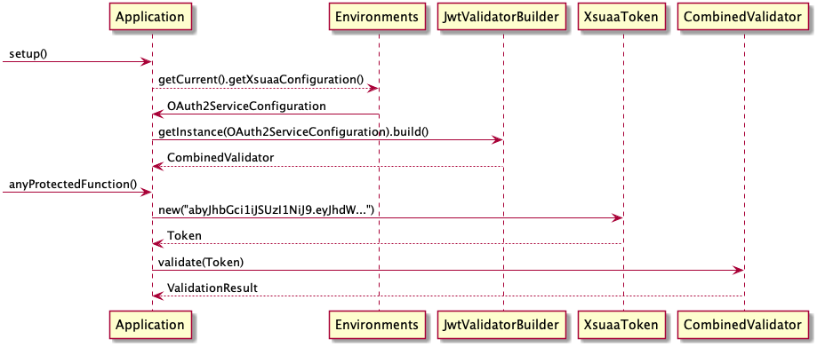
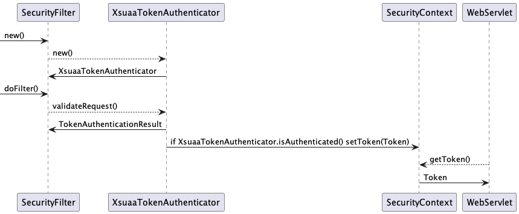

# SAP CP Java Security Client Library

Token Validation for Java applications.

- Loads Identity Service Configuration from `VCAP_SERVICES` environment. The [`Environments`](src/main/java/com/sap/cloud/security/config/Environments.java) serves as central entry point to get or parse the  [`OAuth2ServiceConfiguration`](src/main/java/com/sap/cloud/security/config/OAuth2ServiceConfiguration.java) within SAP Cloud Platform.
- Decodes and parses encoded JSON Web Tokens ([`Token`](/java-api/src/main/java/com/sap/cloud/security/token/Token.java)) and provides convenient access to token header parameters and claims. A Java implementation of JSON Web Token (JWT) - [RFC 7519](https://tools.ietf.org/html/rfc7519). 
- Validates the decoded token. The [`JwtValidatorBuilder`](src/main/java/com/sap/cloud/security/token/validation/validators/JwtValidatorBuilder.java) comprises the following mandatory checks:
  - Is the JWT used before the `exp` (expiration) time and eventually is it used after the `nbf` (not before) time ([`JwtTimestampValidator`](
 src/main/java/com/sap/cloud/security/token/validation/validators/JwtTimestampValidator.java))?
  - Is the JWT issued by a trust worthy identity service ([`JwtIssuerValidator`](
 src/main/java/com/sap/cloud/security/token/validation/validators/JwtIssuerValidator.java))?  
In case of XSUAA does the JWT provide a valid `jku` token header parameter that points to a JWKS url from a trust worthy identity service ([`XsuaaJkuValidator`](
 src/main/java/com/sap/cloud/security/token/validation/validators/XsuaaJkuValidator.java)) as it matches the uaa domain?
  - Is the JWT intended for the OAuth2 client of this application? The `aud` (audience) claim identifies the recipients the JWT is issued for ([`JwtAudienceValidator`](
 src/main/java/com/sap/cloud/security/token/validation/validators/JwtAudienceValidator.java)).
  - Is the JWT signed with the public key of the trust-worthy identity service? With that it also makes sure that the payload and the header of the JWT is unchanged ([`JwtSignatureValidator`](
 src/main/java/com/sap/cloud/security/token/validation/validators/JwtSignatureValidator.java))?
- Provides thread-local cache ([`SecurityContext`](/java-api/src/main/java/com/sap/cloud/security/token/SecurityContext.java)) to store the decoded and validated token.
- Furthermore, it provides an authenticator ([`TokenAuthenticator`](/java-api/src/main/java/com/sap/cloud/security/servlet/TokenAuthenticator.java)) that validates bearer tokens contained in the authorization header of HTTP requests. The authenticator is used in SAP Java Buildpack, as well as in the [/samples/java-security-usage*](/samples).



## Open Source libs used
- JSON Parser Reference implementation: [json.org](https://github.com/stleary/JSON-java)
- No crypto library. Leverages Public Key Infrastructure (PKI) provided by Java Security Framework to verify digital signatures.

## Supported Environments
- Cloud Foundry
- Planned: Kubernetes

## Supported Identity Services
- XSUAA
- as of version `2.8.0` IAS

## Supported Algorithms

| JWS | Algorithm | Description |
| :-------------: | :-------------: | :----- |
| RS256 | RSA256 | RSASSA-PKCS1-v1_5 with SHA-256 |


## Configuration

### Maven Dependencies
```xml
<dependency>
    <groupId>com.sap.cloud.security</groupId>
    <artifactId>java-security</artifactId>
    <version>2.8.7</version>
</dependency>
<dependency>
    <groupId>org.apache.httpcomponents</groupId>
    <artifactId>httpclient</artifactId>
</dependency>
```

### Logging

This library uses [slf4j](http://www.slf4j.org/) for logging. It only ships the [slf4j-api module](https://mvnrepository.com/artifact/org.slf4j/slf4j-api) and no actual logger implementation.
For the logging to work slf4j needs to find a valid logger implementation at runtime. 
If your app is deployed via buildpack then you will have one available and logging should just work.

If there is no valid logger binding at runtime you will see an error message like this:
```log
SLF4J: Failed to load class "org.slf4j.impl.StaticLoggerBinder".
SLF4J: Defaulting to no-operation (NOP) logger implementation
```
In this case you need to add a logger implementation dependency to your application.
See the slf4j [documentation](http://www.slf4j.org/codes.html#StaticLoggerBinder)
for more information and a [list](http://www.slf4j.org/manual.html#swapping) of available
logger options.

## Basic Usage

### Setup Step 1: Load the Service Configuration(s)
```java
OAuth2ServiceConfiguration serviceConfig = Environments.getCurrent().getXsuaaConfiguration();
```
> Note: By default `Environments` auto-detects the environment: Cloud Foundry or Kubernetes.

Alternatively you can also specify the Service Configuration by your own:
```java
OAuth2ServiceConfiguration serviceConfig = OAuth2ServiceConfigurationBuilder.forService(Service.XSUAA)
      .withProperty(CFConstants.XSUAA.APP_ID, "appid")
      .withProperty(CFConstants.XSUAA.UAA_DOMAIN, "authentication.sap.hana.ondemand.com")
      .withUrl("https://paas.authentication.sap.hana.ondemand.com")
      .withClientId("oauth-client")
      .withClientSecret("oauth-client-secret")
      .build();
```

### Setup Step 2: Setup Validators
Now configure the `JwtValidatorBuilder` once with the service configuration from the previous step.
```java
CombiningValidator<Token> validators = JwtValidatorBuilder.getInstance(serviceConfig).build();
```
> Note: By default `JwtValidatorBuilder` builds a `CombiningValidator`. 

> For the Signature validation it needs to fetch the Json Web Token Keys (jwks) from the OAuth server. In case the token does not provide a `jku` header parameter it also requests the Open-ID Provider Configuration from the OAuth Server to determine the `jwks_uri`. The used Apache Rest client can be customized via the `JwtValidatorBuilder` builder.  

> Furthermore the token keys fetched from the Identity Service are cached for about 10 minutes. You may like to overwrite the cache [default configuration](/java-security/src/main/java/com/sap/cloud/security/token/validation/validators/TokenKeyCacheConfiguration.java#L14) with `JwtValidatorBuilder.withCacheConfiguration()`.  

#### [Optional] Step 2.1: Add Validation Listeners for Audit Log
Optionally, you can add a validation listener to the validator to be able to get called back whenever a token is validated. Here you may want to emit logs to the audit log service.

```java
JwtValidatorBuilder.getInstance(serviceConfig).withValidatorListener(validationListener);
```

The validation listener needs to implement the [ValidationListener](src/main/java/com/sap/cloud/security/token/validation/ValidationListener.java) interface to be able to receive callbacks on validation success or failure.

### Create a Token Object 
This decodes an encoded JSON Web Token (JWT) and parses its json header and payload. The `Token` interface provides a simple access to its JWT header parameters and its claims. You can find the claim constants in the ([`TokenClaims`](/java-api/src/main/java/com/sap/cloud/security/token/TokenClaims.java)) class.

```java
String authorizationHeader = "Bearer eyJhbGciOiJGUzI1NiJ2.eyJhh...";
Token token = new XsuaaToken(authorizationHeader);
```

### Validate Token to check Authentication

```java
ValidationResult result = validators.validate(token);

if(result.isErroneous()) {
   logger.warn("User is not authenticated: " + result.getErrorDescription());
}
```

### Cache validated Token (thread-locally)
```java
SecurityContext.setToken(token);
```

### Get information from Token
```java
Token token = SecurityContext.getToken();

String email = token.getClaimAsString(TokenClaims.EMAIL);
List<String> scopes = token.getClaimAsStringList(TokenClaims.XSUAA.SCOPES);
java.security.Principal principal = token.getPrincipal();
Instant expiredAt = token.getExpiration();
String keyId = token.getHeaderParameterAsString(TokenHeader.KEY_ID);
...
```

### Get further information from `VCAP_SERVICES`
In case you need further details from `VCAP_SERVICES` system environment variable, which are not exposed by `OAuth2ServiceConfiguration` interface you can use the `DefaultJsonObject` class for Json parsing. 

Example:
```java
String vcapServices = System.getenv(CFConstants.VCAP_SERVICES);
JsonObject serviceJsonObject = new DefaultJsonObject(vcapServices).getJsonObjects(Service.XSUAA.getCFName()).get(0);
Map<String, String> xsuaaConfigMap = serviceJsonObject.getKeyValueMap();
Map<String, String> credentialsMap = serviceJsonObject.getJsonObject(CFConstants.CREDENTIALS).getKeyValueMap();
```

## Token based authentication
The servlet authenticator part of this library makes it easy to integrate token based authentication into your java application.
For the integration of different Identity Services the [`TokenAuthenticator`](/java-api/src/main/java/com/sap/cloud/security/servlet/TokenAuthenticator.java) interface was created. Right now there are these implementations:

- [XsuaaTokenAuthenticator](src/main/java/com/sap/cloud/security/servlet/XsuaaTokenAuthenticator.java)
- [IasTokenAuthenticator](src/main/java/com/sap/cloud/security/servlet/IasTokenAuthenticator.java)

> Depending on the application's needs the `TokenAuthenticator` can be customized.



### IAS to Xsuaa token exchange
`XsuaaTokenAuthenticator` supports seamless token exchange between IAS and Xsuaa. Token exchange between IAS and Xsuaa means that calling a web application endpoint with an IAS Token will work like calling the endpoint with Xsuaa Token. This functionality is disabled by default.
Requirement for token exchange is `token-client` dependency with all its' transitive dependencies in the project.

```xml
<dependency>
    <groupId>com.sap.cloud.security.xsuaa</groupId>
    <artifactId>token-client</artifactId>
</dependency>
```

Steps to enable token exchange:
1. Set environment variable `IAS_XSUAA_XCHANGE_ENABLED` to any value except false or empty
2. Make sure `token-client` is not excluded from the project
3. In order to leverage the token cache, consider the `token-client` initialization notes [here](https://github.com/SAP/cloud-security-xsuaa-integration/blob/master/token-client/README.md#cache)

The authenticator is used in the following [sample](/samples/java-security-usage).

## Test Utilities
You can find the JUnit test utilities documented [here](/java-security-test).

## Enable local testing for XSUAA Identity Service
When you like to test/debug your secured application rest API locally (offline) you need to provide custom `VCAP_SERVICES` before you run the application. The security library requires the following key value pairs in the `VCAP_SERVICES`
under `xsuaa/credentials` for jwt validation:
- `"uaadomain" : "localhost"`
- `"verificationkey" : "<public key your jwt token is signed with>"`

Before calling the service you need to provide a digitally signed JWT token to simulate that you are an authenticated user. 
You can use the `JWTGenerator`, which is provided with [java-security-test](/java-security-test) test library. 

Now you can test the service manually in the browser using a REST client such as `Postman` chrome plugin and provide the generated JWT token as `Authorization` header to access the secured functions.

A detailed step-by-step description and a sample can be found [here](https://github.com/SAP-samples/cloud-bulletinboard-ads/blob/Documentation/Security/Exercise_24_MakeYourApplicationSecure.md#step-5-run-and-test-the-service-locally).


## Troubleshoot

In case you face issues, [file an issue on Github](https://github.com/SAP/cloud-security-xsuaa-integration/issues/new)
and provide these details:
- security related dependencies, get dependency tree with `mvn dependency:tree`
- [(SAP) Java buildpack version, e.g. 1.26.1](#get-buildpack-version)
- [debug logs](#increase-log-level-to-debug)
- issue you’re facing / steps to reproduce.

### Get buildpack version

The buildpack being used is defined in your deployment descriptor e.g. as part of the `manifest.yml` file via the
[buildpacks](https://docs.cloudfoundry.org/devguide/deploy-apps/manifest-attributes.html#buildpack) attribute.

If it is set to `sap_java_buildpack` then the **newest** available version of the SAP Java buildpack is used.
Use command `cf buildpacks` to get the exact version of `sap_java_buildpack`:

```sh
buildpack                       position   enabled   locked   filename                                             stack
java_buildpack                  2          true      false    java_buildpack-cached-cflinuxfs3-v4.31.1.zip         cflinuxfs3
.
.
.
sap_java_buildpack              12         true      false    sap_java_buildpack-v1.32.0.zip
sap_java_buildpack_1_32         13         true      false    sap_java_buildpack-v1.32.0.zip
sap_java_buildpack_1_31         14         true      false    sap_java_buildpack-v1.31.2.zip
```

### Increase log level to `DEBUG`

This depends on the SLF4J implementation, you make use of (see also [here](#logging)). You have to set the debug log level for this package `com.sap.cloud.security`.

#### ... when using SAP Java Buildpack

You should also increase the logging level in your application. This can be done by setting the `SET_LOGGING_LEVEL`
environment variable for your application. You can do this as part of your deployment descriptor such as `manifest.yml` with the `env` section like so:

```yaml
env:
    SET_LOGGING_LEVEL: '{com.sap.xs.security: DEBUG, com.sap.cloud.security: DEBUG}'
```

After you have made changes to the deployment descriptor you need do re-deploy your app.

For a running application this can also be done with the `cf` command line tool:

```shell
cf set-env <your app name> SET_LOGGING_LEVEL "{com.sap.xs.security: DEBUG, com.sap.cloud.security: DEBUG}"
```

You need to restage your application for the changes to take effect.

### Common Pitfalls

#### This module requires the [JSON-Java](https://github.com/stleary/JSON-java) library.
If you have classpath related  issues involving JSON you should take a look at the
[Troubleshooting JSON class path issues](/docs/Troubleshooting_JsonClasspathIssues.md) document.

#### ServletContext.getAccessToken() returns null
`SecurityContext` caches only sucessfully validated tokens thread-locally, i.e. within the same thread. Please increase the log level as described [here](#increase-log-level-to-debug) in order to check whether the token validation fails and for which reason.

In case you use **SAP Java Buildpack** for token validation, make sure that your J2EE Servlet is annotated with a scope check, like:
```java
@ServletSecurity(@HttpConstraint(rolesAllowed = { "yourScope" }))
```
Or, alternatively in `src/main/webapp/WEB-INF/web.xml`:
```xml
<web-app...
  <security-constraint>
        <web-resource-collection>
            <web-resource-name>All SAP Cloud Platform users</web-resource-name>
            <url-pattern>/*</url-pattern>
        </web-resource-collection>
        <auth-constraint>
            <role-name>YourScope</role-name>
        </auth-constraint>
    </security-constraint>
</web-app>
```

> In case your application provides no scopes, consider the documentation [here](Migration_SAPJavaBuildpackProjects_V2.md#new-feature-sap-java-buildpack-without-application-roles).


#### java.util.ServiceConfigurationError: com.sap.cloud.security.token.TokenFactory: Provider com.sap.cloud.security.servlet.HybridTokenFactory not a subtype
As of version [`2.8.3`](https://github.com/SAP/cloud-security-xsuaa-integration/releases/tag/2.8.3) the version of `java-api` needs to match the version of `java-security` client library. In case you use the **SAP Java Buildpack** `java-security` is provided. To keep them in synch its recommended to use [SAP Java Buildpack BoM](https://help.sap.com/viewer/65de2977205c403bbc107264b8eccf4b/Cloud/en-US/6c6936e8e4ea40c9a9a69f6783b1e978.html) of the respective SAP Java Buildpack version and as done in the [sap-java-buildpack-api-usage sample](/samples/sap-java-buildpack-api-usage/pom.xml).

## Specs und References
1. [JSON Web Token](https://tools.ietf.org/html/rfc7519)
2. [OpenID Connect Core 1.0 incorporating errata set 1](https://openid.net/specs/openid-connect-core-1_0.html)
3. [OpenID Connect Core 1.0 incorporating errata set 1 - ID Token Validation](https://openid.net/specs/openid-connect-core-1_0.html#IDTokenValidation)

## Samples
- [Xsuaa Sample](/samples/java-security-usage)    
demonstrating how to leverage ``java-security`` library to perform authentication and authorization checks within a Java application when bound to a xsuaa service. Furthermore it documents how to implement JUnit Tests using `java-security-test` library.

- [Ias Sample](/samples/java-security-usage-ias)    
demonstrating how to leverage ``java-security`` library to perform authentication checks within a Java application when bound to a ias identity service. Furthermore it documents how to implement JUnit Tests using `java-security-test` library.


