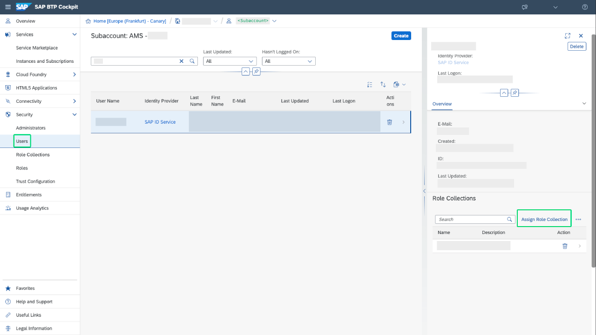

# Description
This sample uses `SAPOfflineTokenServicesCloud`.

## Compile the Java application
Run maven to package the application
```shell
mvn clean package
```

## Create the XSUAA service instance
Use the [xs-security.json](./xs-security.json) to define the authentication settings and create a service instance
```shell
cf create-service xsuaa application xsuaa-sap-offline-token-services-cloud -c xs-security.json
```

## Configure the manifest
The [vars](../vars.yml) contains hosts and paths that need to be adopted.

## Deploy the application
Deploy the application using cf push. It will expect 1 GB of free memory quota.

```shell
cf push --vars-file ../vars.yml
```

## Cockpit administration tasks: Assign Role to your User
Finally, as part of your Identity Provider, e.g. SAP ID Service, assign the deployed Role Collection such as `SAP_OFFLINE_TOKEN_SERVICES` to your user as depicted in the screenshot below and as documented [here](https://help.sap.com/viewer/65de2977205c403bbc107264b8eccf4b/Cloud/en-US/9e1bf57130ef466e8017eab298b40e5e.html).



Further up-to-date information you can get on sap.help.com:
- [Maintain Role Collections](https://help.sap.com/viewer/65de2977205c403bbc107264b8eccf4b/Cloud/en-US/d5f1612d8230448bb6c02a7d9c8ac0d1.html)
- [Maintain Roles for Applications](https://help.sap.com/viewer/65de2977205c403bbc107264b8eccf4b/Cloud/en-US/7596a0bdab4649ac8a6f6721dc72db19.html).


## Access the application
After deployment, the spring service can be called with basic authentication.
```shell
curl -i --user "<SAP ID Service User>:<SAP ID Service Password>" https://sap-offline-token-services-cloud-<ID>.<LANDSCAPE_APPS_DOMAIN>/hello-token
```

You will get a response like:
```
Hello your.user@sap.com
```

## Clean-Up

Finally delete your application and your service instances using the following commands:
```
cf delete -f sap-offline-token-services-cloud
cf delete-service -f xsuaa-sap-offline-token-services-cloud
```

